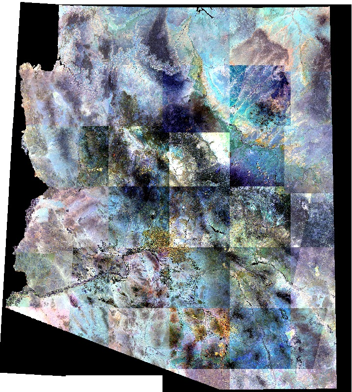
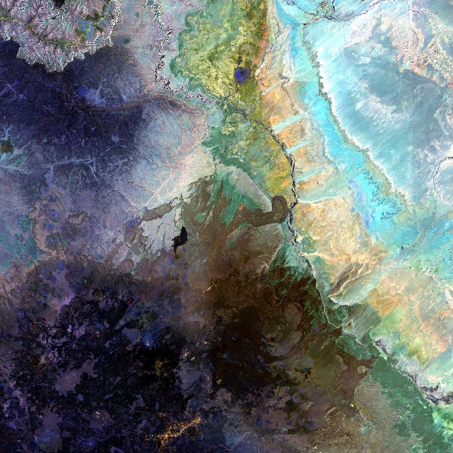
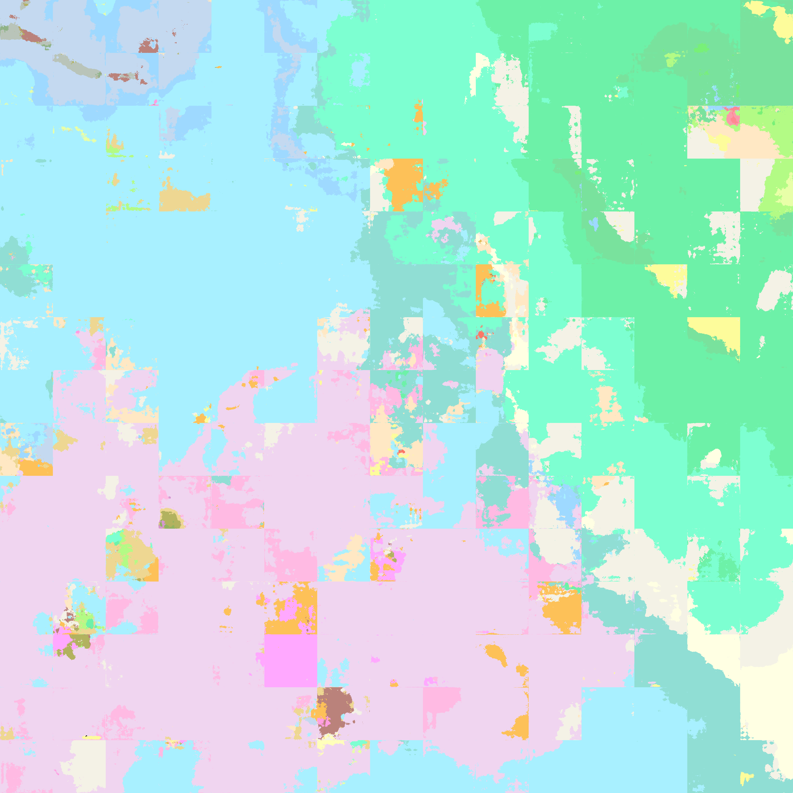
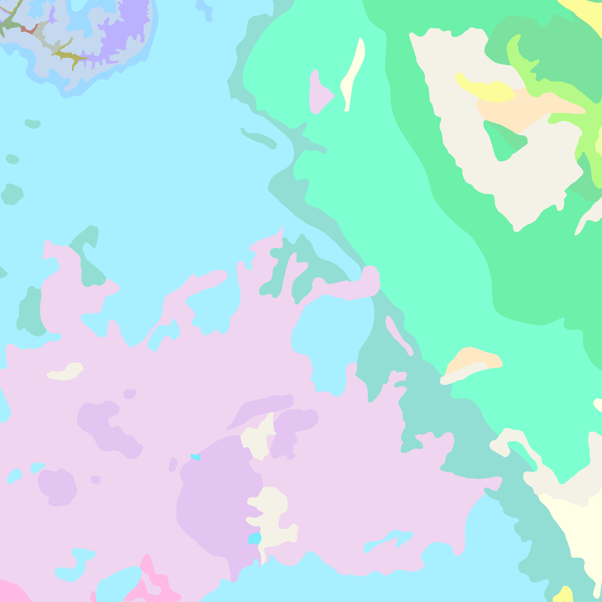

# Geomapper - DSI Capstone
Galvanize G83 Data Science Immersive Phoenix -- Capstone

This repo contains code in support of my Galvanize Data Science Immersive capstone project.
The project uses multispectral satellite imagery of the state of Arizona acquired by ESA's Sentinel-2 mission. 

Using a "Geology" band combination of 2-4-12 and training labels consisting of the State's Geologic map units trained a neural network architecture model backend of TensorFlow DeepLab's Xception_65 using the Rastervision library to construct the experiment. The project attempts to predict the geology using semantic segmentation, or pixel-wise classification, from satellite imagery.

## Test Image

## Predicted

## Actual

A model was trained using Sentinel 2 Satellite Imagery for the state of Arizona and the State Geologic Map.  Model training took approximately 23.8 hours on a P3.2XLarge AWS EC2 Instance using a NVIDIA Tesla V100 GPU though a Docker container and acheived a recall = .71, precision = .73, and F1 score = .71.